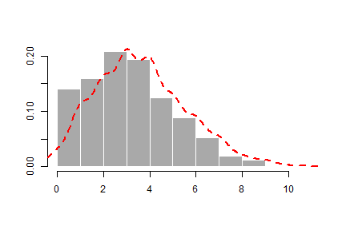
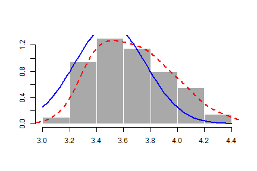

## Purpose of the app

This app is to demonstrate the Central Limited Theorem (CLT), which states that the distribution of sample statistics is nearly normal, centered at the population mean, and with a standard deviation equal to the population standard deviation divided by square root of the sample size:

$$
\bar{X} - N(mean = \mu, SE = \frac{\sigma}{\sqrt{n}})
$$

--- 

## Input

There are two interactive slide bar inputs:

1. $\lambda$, which determines the poisson distrubtion's mean and variance.
2. N, The sample size of the 100 samples drawn from the "total population", the 1000 points generated in step 1 forming the poisson distribution.


## Output

There are two graphs. 

The first graph is the frequency histogram of the 1000 points drawn from the poisson distribution, with a red curve indicating the shape of the distribution. 

The second graph is the frequency histogram of the 100 means of the 100 samples. The red curve is also the shape of the distribution, whereas the blue curve indicates the theoretical density curve of the 100 means.

By seeing the red and blue curves overlap, one can get a sense of the correctness of CLT.

---

## The Poisson distribution
* Used to model counts
* The Poisson mass function is
$$
P(X = x; \lambda) = \frac{\lambda^x e^{-\lambda}}{x!}
$$
for $x=0,1,\ldots$
* The mean of this distribution is $\lambda$
* The variance of this distribution is $\lambda$
* Notice that $x$ ranges from $0$ to $\infty$

---

## Demo
$\lambda$ = 3.5, N = 50

```r
lambda <- 3.5
n <- 1000
points<-rpois(n, lambda)
hist(points, freq = FALSE, col = 'darkgray', border = 'white', ann=FALSE)
lines(density(points)$x, density(points)$y, col="red", lwd=2, lty=2)
```

 

---

## sample means


```r
N<-50
means <- 1:100
for(i in 1:100){
  means[i] <- mean(sample(points, N))
}
hist(means, freq = FALSE, col = 'darkgray', border = 'white', ann=FALSE)
lines(density(means)$x, density(means)$y, col="red", lwd=2, lty=2)
curve(dnorm(x, lambda, (lambda/N)^0.5), add=TRUE, col="blue", lwd=2)
```

 


    
